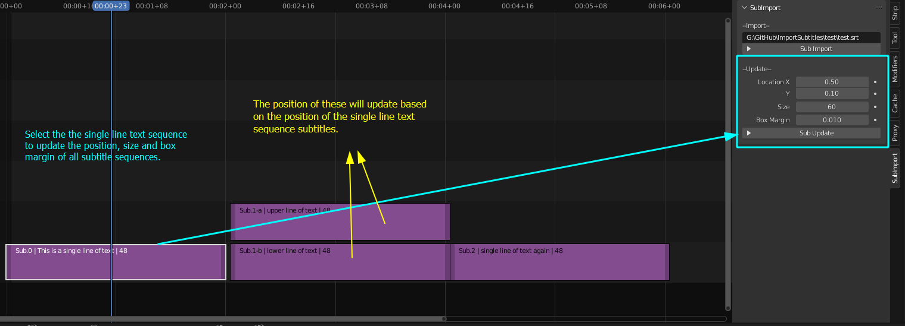

# Import Subtitles for Blender VSE

Addon for adding subtitle files to blender VSE as `Text` sequences. Using [pysub2](https://github.com/tkarabela/pysubs2) python module.

## Supported formats by pysubs2 -
  * SubStation Alpha 
    - `.ass` - tested
    - `.ssa` - not tested
  
#### Time-Based Formats
  * SubRip          
    - `.str` - tested
  * MPL2 Time-based format similar to MicroDVD
    - `.mpl2` - not tested
  * TMP
    - `.tmp` - not tested
  * WebVTT
    - `.vtt` - tested.

#### Frame-based Formats
  * MicroDVD
    -`.sub` - not tested

## UI
Input Section: 

  * String input - takest the full file path to your subtitle file.
  * Sub Import button - runs the script that imports subtitles as sequences of type 'Text'.
      - sequences are placed on the two topmost channels in VSE.
      - only two line subtitles are supported
      - pressing the button again will compare the sequences and their text,start time, end time, and will apply the changes.

NOTE: Updating sequences(in cases where the sequence/text is on the first channel or the one/lower line subtitle) because blender does not allow two sequences to overlap in one channel and because I didn't spent time to make it account for that, changing the time might result in that line popping to the above channel.

Update section

  * Takes the position, font size, and box margin settings and exposes them to the user.
    - Note: these are the selected sequence's settings you don't need to edit those there but I just exposed them in the panel.
  * Sub Update buttom - runs the update script. Updates position based on the single line seqnece's position, font size and box margin(mainly because the double line subtitles's position have to be updated as well) 

All other changes like font color,box margin or box margin color can be applied via the Copy to Selected so I haven't implemented anything to deal with this.

